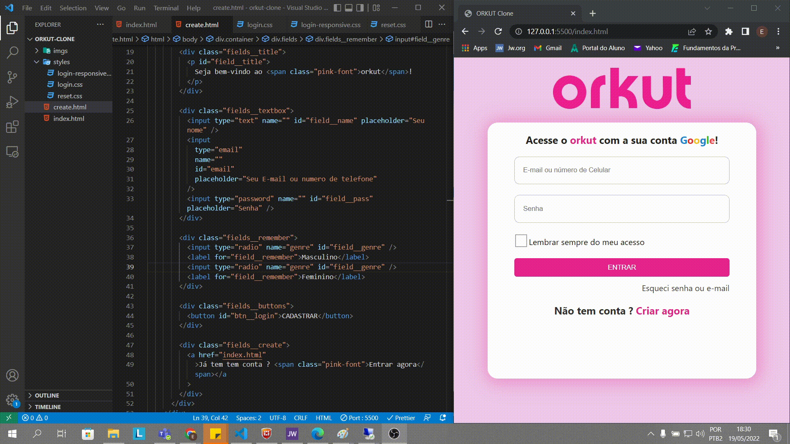

# Clone Orkut

Desenvolvendo uma página de login para a volta de rede social Orkut.

## Etiquetas

## Demonstração

## Utilizado:

**Front-end:** HML5, CSS3

## Deploy:

<a href="https://diegoreports.github.io/orkut-clone/">https://diegoreports.github.io/orkut-clone/</a>
